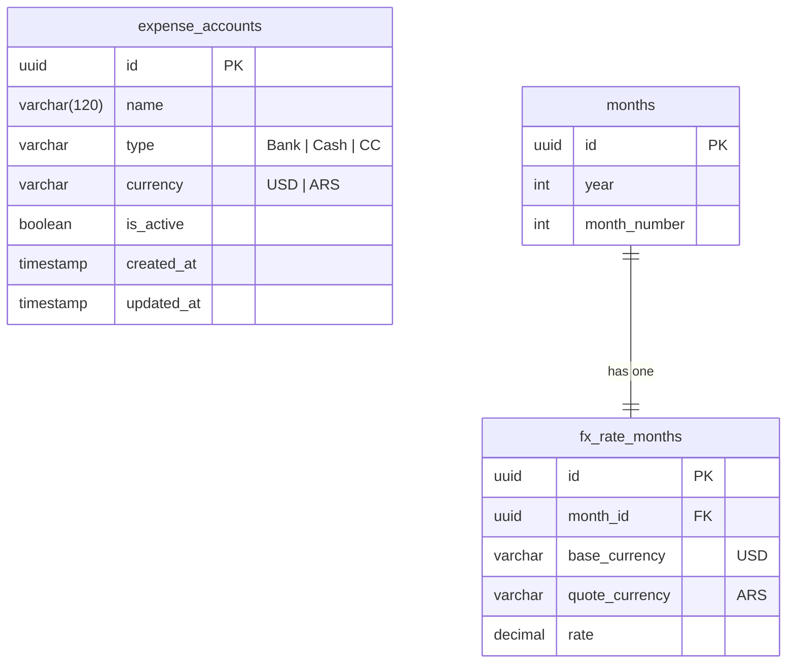

# Database Schema

```mermaid
erDiagram
    expense_accounts {
        uuid id PK
        varchar(120) name
        varchar type "Bank | Cash | CC"
        varchar currency "USD | ARS"
        boolean is_active
        timestamp created_at
        timestamp updated_at
    }

    months {
        uuid id PK
        int year
        int month_number
    }

    fx_rate_months {
        uuid id PK
        uuid month_id FK
        varchar base_currency "USD"
        varchar quote_currency "ARS"
        decimal rate
    }

    months ||--|| fx_rate_months : "has one"
```
