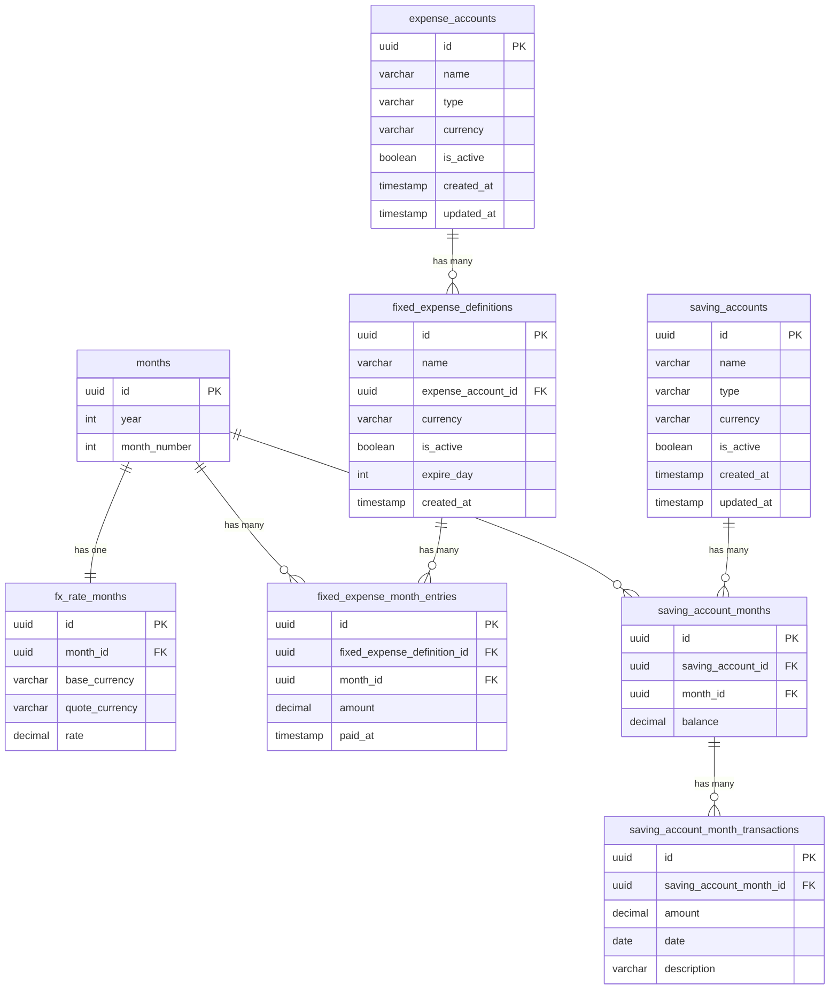

# Database Schema

```mermaid
erDiagram
    expense_accounts {
        uuid id PK
        varchar name
        varchar type
        varchar currency
        boolean is_active
        timestamp created_at
        timestamp updated_at
    }

    saving_accounts {
        uuid id PK
        varchar name
        varchar type
        varchar currency
        boolean is_active
        timestamp created_at
        timestamp updated_at
    }

    months {
        uuid id PK
        int year
        int month_number
    }

    fx_rate_months {
        uuid id PK
        uuid month_id FK
        varchar base_currency
        varchar quote_currency
        decimal rate
    }

    fixed_expense_definitions {
        uuid id PK
        varchar name
        uuid expense_account_id FK
        varchar currency
        boolean is_active
        int expire_day
        timestamp created_at
    }

    fixed_expense_month_entries {
        uuid id PK
        uuid fixed_expense_definition_id FK
        uuid month_id FK
        decimal amount
        timestamp paid_at
    }

    saving_account_months {
        uuid id PK
        uuid saving_account_id FK
        uuid month_id FK
        decimal balance
    }

    saving_account_month_transactions {
        uuid id PK
        uuid saving_account_month_id FK
        decimal amount
        date date
        varchar description
    }

    months ||--|| fx_rate_months : "has one"
    expense_accounts ||--o{ fixed_expense_definitions : "has many"
    fixed_expense_definitions ||--o{ fixed_expense_month_entries : "has many"
    months ||--o{ fixed_expense_month_entries : "has many"
    saving_accounts ||--o{ saving_account_months : "has many"
    months ||--o{ saving_account_months : "has many"
    saving_account_months ||--o{ saving_account_month_transactions : "has many"
```
